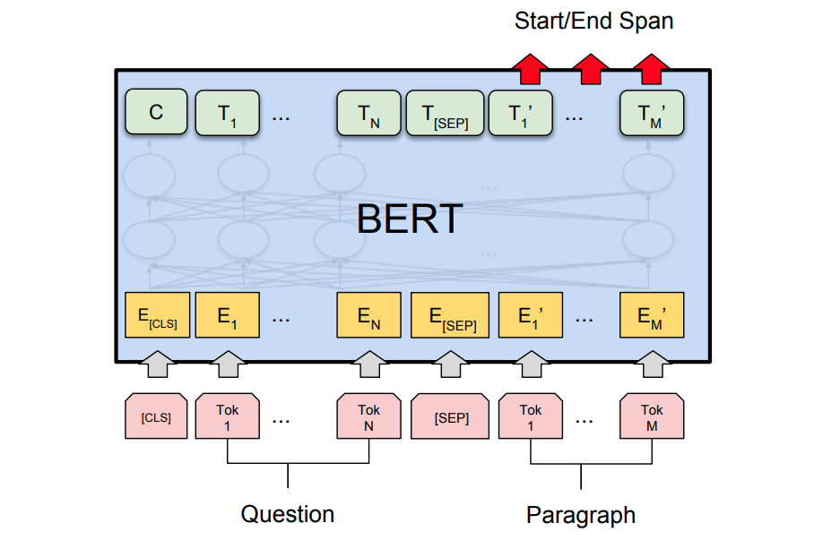
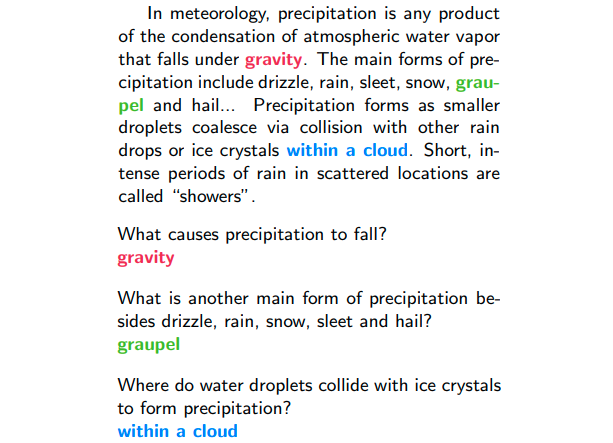

[Paper](https://arxiv.org/abs/1810.04805)   &nbsp; &nbsp; &nbsp; &nbsp; [Code](https://github.com/NVIDIA/DeepLearningExamples/tree/master/PyTorch/LanguageModeling/BERT)

Learning language representation is central to many NLP tasks. Early language modeling methods concern the problem of mapping individual words or phrases from the vocabulary to [vectors of real numbers](https://en.wikipedia.org/wiki/Word2vec), so numerical computation can be applied to input texts. The holy grail of language modeling, however, is to build a statistical model over a sequence of words, so a probability can be assigned to a word given the context surrounding the word. A strong language model is crucial to downstream tasks such as sentence classification, sentence pair classification, question answering, and text generation etc.

[BERT](https://arxiv.org/abs/1810.04805), short for Bidirectional Encoder Representations from Transformers, is designed to pre-train deep language representation from unlabeled text. When published in 2018, fine-tuned BERT models obtained state-of-the-art results on eleven natural language processing tasks, including pushing the GLUE score to 80.5% (7.7% point absolute improvement), MultiNLI accuracy to 86.7% (4.6% absolute improvement), SQuAD v1.1 question answering Test F1 to 93.2 (1.5 point absolute improvement) and SQuAD v2.0 Test F1 to 83.1 (5.1 point absolute improvement).

Compared to other popular language models such as [GPT](https://openai.com/blog/language-unsupervised/) which is trained for the task of next word prediction, the largest difference and improvement of BERT is to make training bi-directional. In particular, a novel masked language task is used to randomly mask some of the tokens from the input, and the objective is to predict the masked tokens based on their left context and right context. In addition, BERT introduces a special `[CLS]` token at the beginning of the input text to slickly encode the entire sequence for classification tasks. 

## Architecture

A pre-trained BERT model extracts a deep feature for each token in the input sequence  (The green boxes in the architecture diagram below), including the special `[CLS]` token added at the beginning. Similar to fine-tuning image models such as `VGG` and `ResNet`, fine-tuning BERT requires adding a final layer on top of the deep feature. 

For question answering tasks such as SQuAD, the input question and passage are concatenated into a single sequence (the pink blocks). A final layer is introduced to predict the text span of the answer in the input passage. Precisely, this final layer learns two linear mappings that compute for each token its probabilities of being the start or the end of answer (the red arrows).

The performance on SQuAD dataset is evaluated using the `F1` score, which measures the [average overlap](https://en.wikipedia.org/wiki/F1_score) between the prediction and ground truth answer.

*Fine-tuning BERT for question answering tasks (SQuAD). Image from [BERT: Pre-training of Deep Bidirectional Transformers for Language Understanding, Devlin et al.](https://arxiv.org/abs/1810.04805)*

## Dataset

For the pre-training corpus BERT use the [BooksCorpus](https://yknzhu.wixsite.com/mbweb) (800M words) and [English Wikipedia](https://dumps.wikimedia.org/) (2,500M words). The performance of BERT is evaluated using downstream tasks such as text classification and question answering.

A popular question answering dataset is The Stanford Question Answering Dataset ([SQuAD](https://rajpurkar.github.io/SQuAD-explorer/)). It is a reading comprehension dataset, consisting of questions posed by crowdworkers on a set of Wikipedia articles, where the answer to every question is a segment of text, or span, from the corresponding reading passage, or the question might be unanswerable. SQuAD1.1 contains 100,000+ question-answer pairs on 500+ articles. SQuAD2.0 combines the 100,000 questions in SQuAD1.1 with over 50,000 unanswerable questions written adversarially by crowdworkers to look similar to answerable ones.

*Question-answer pairs for a sample passage in the SQuAD dataset. Each of the answers is a segment of text from the passage. Image from [SQuAD: 100,000+ Questions for Machine Comprehension of Text, Rajpurkar et al.](https://arxiv.org/abs/1606.05250)*

## GPU Benchmark

import { ModelChart } from './../../../www/src/components/lambda-items.js'

We benchmark the training throughput for two different flavors of BERT (base and large) using different GPUs in both FP32 and FP16 precisions. The benchmark is conducted using NVidia docker images. You can use this [repository](https://github.com/lambdal/deeplearning-benchmark) to reproduce the results in the charts below.

<ModelChart selected_model='bert_base_squad' selected_gpu='V100' selected_metric="throughput"/>

*Maximum training throughput of Fine-tuning BERT Base on SQUAD (Tokens/Second)*

<ModelChart selected_model='bert_base_squad' selected_gpu='V100' selected_metric="bs"/>

*Maximum training batch size of Fine-tuning BERT Base on SQUAD (Tokens/Batch)*

<ModelChart selected_model='bert_large_squad' selected_gpu='V100' selected_metric="throughput"/>

*Maximum training throughput of Fine-tuning BERT Large on SQUAD (Tokens/Second)*

<ModelChart selected_model='bert_large_squad' selected_gpu='V100' selected_metric="bs"/>

*Maximum training batch size of Fine-tuning BERT Large on SQUAD (Tokens/Batch)*