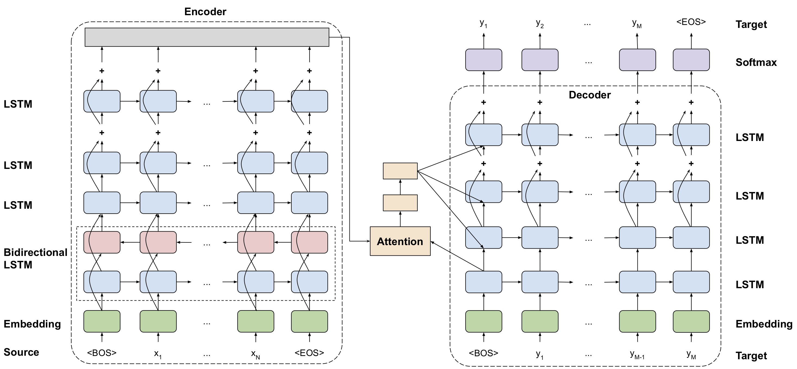

[Paper](https://arxiv.org/abs/1609.08144)   &nbsp; &nbsp; &nbsp; &nbsp; [Code](https://github.com/NVIDIA/DeepLearningExamples/tree/master/PyTorch/Translation/GNMT)

[Machine translation](https://en.wikipedia.org/wiki/Machine_translation) is a sub-field of computational linguistics that investigates the use of software to translate text or speech from one language to another. Recurrent neural networks with [long short-term memory](https://www.bioinf.jku.at/publications/older/2604.pdf) have been widely used to build neural machine translation (NMT) systems with the strength of learning, in an end-to-end fashion, the mapping from input text to associated output text. Unfortunately, recurrent systems are computationally expensive both in training and in inference – sometimes prohibitively so in the case of very large data sets and large models<sup id="a1">[1](#f1)</sup>.

Developed in 2016, Google’s Neural Machine Translation system (GNMT) strikes good performance in both accuracy and speed. On the WMT’14 English-to-French and English-to-German benchmarks, GNMT achieves competitive results to state-of-the-art. Using a human side-by-side evaluation on a set of isolated simple sentences, it reduces translation errors by an average of 60% compared to Google’s phrase-based production system.


## Architecture

GNMT consists of "a deep LSTM network with 8 encoder and 8 decoder layers using residual connections as well as attention connections from the decoder network to the encoder"<sup id="a1">[1](#f1)</sup>. To improve parallelism and therefore decrease training time, attention mechanism is used to connect the bottom layer of the decoder to the top layer of the encoder. To accelerate the final translation speed, low-precision arithmetic is used during inference computations. Words are divided into a limited set of common sub-word units ([wordpieces](https://github.com/google/sentencepiece)) for both input and output.

The GNMT v2 model is similar to the model described in the [original paper](https://arxiv.org/abs/1609.08144). The most important difference between the two models is in the attention mechanism<sup id="a2">[2](#f1)</sup>. 

> In V2, the output from the first LSTM layer of the decoder goes into the attention module, then the re-weighted context is concatenated with inputs to all subsequent LSTM layers in the decoder at the current time step.


*Archiecture diagram of GNMT v2. Image from NVidia's DeepLearningExample [Repo](https://github.com/NVIDIA/DeepLearningExamples/tree/master/PyTorch/Translation/GNMT#model-overview)*

## Dataset

A popular metric for evaluating machine translation models is the [BLEU](https://en.wikipedia.org/wiki/BLEU) score. It stands for "Bilingual Evaluation Understudy" and evaluates the quality of a machine translated sentence by comparing it against human reference translations. The approach works by counting matching n-grams in the candidate translation to n-grams in the reference text, where 1-gram or unigram would be each token and a bigram comparison would be each word pair<sup id="a3">[3](#f3)</sup>. The comparison is made regardless of word order. The result is typically measured on a 0 to 1 scale, with 1 as the hypothetical “perfect” translation.

The Workshop on Machine Translation ([WMT](http://www.statmt.org/wmt19/)) dataset is the standard benchmark for machine translation. The original GNMT paper trained and evaluated its models on the `WMT En->Fr` dataset (36M training sentence pairs) and `WMT En->De` dataset (5M training sentence pair), and scored 38.95% BLEU and 24.17% BLEU respectively. 


## GPU Benchmark

import { ModelChart } from './../../../www/src/components/lambda-items.js'

We benchmark the training throughput for GNMT using different GPUs in both FP32 and FP16 precisions. The benchmark is conducted using NVidia docker images. You can use this [repository](https://github.com/lambdal/deeplearning-benchmark) and the following command to reproduce the results in the charts below.

```
docker run --gpus <devices> \
--rm --shm-size=16g \
-v ~/data:/data \
-v $(pwd)"/scripts":/scripts \
-v $(pwd)"/results":/results nvcr.io/nvidia/pytorch:20.01-py3 \
/bin/bash -c "cp -r /scripts/* /workspace; ./run_benchmark.sh <config_name> gnmt"
```
- `devices`: List of GPU devices. For example: "all", "0", "0,1".
- `config_name`: Name of GPU configuration. Select from `["V100", "QuadroRTX8000", "QuadroRTX6000", "QuadroRTX5000", "TitanRTX", "2080Ti", "1080Ti"]`.

<ModelChart selected_model='gnmt' selected_gpu='V100' selected_metric="throughput"/>

*Maximum training throughput of GNMT (Tokens/Second)*


<ModelChart selected_model='gnmt' selected_gpu='V100' selected_metric="bs"/>

*Maximum training batch size of GNMT (Tokens/Batch)*

## Reference

<b id="f1">[1]</b> Yonghui Wu et al. Google's Neural Machine Translation System: Bridging the Gap between Human and Machine Translation

<br />
<br />

<b id="f2">[2]</b> NVidia's GNMT v2 implementation.

<br />
<br />

<b id="f3">[3]</b> Jason Brownlee. Deep Learning for Natural Language Processing.

