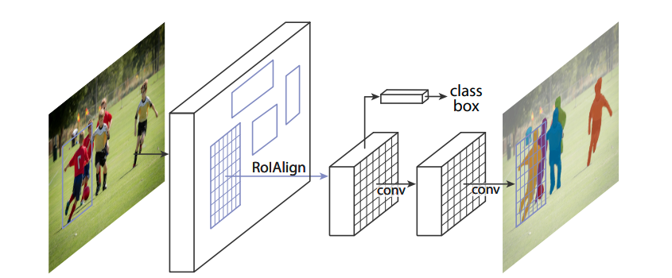

[Paper](https://arxiv.org/abs/1703.06870)   &nbsp; &nbsp; &nbsp; &nbsp; [Code](https://github.com/NVIDIA/DeepLearningExamples/tree/master/PyTorch/Segmentation/MaskRCNN)

Mask R-CNN addresses the problem of `instance segmentation`, which takes object detection a step further by producing not only the bounding box but also the detailed shape of each object. An intuitive way to think about this task is to produce a binary mask for each detected object, so the background pixels can be removed from the content inside of the bounding box.

Mask R-CNN won the 2016 MSCOCO detection challenge with 37.1% `mask mean average precision` (mask mAP). Its recent variation with a [cascade architecture](https://arxiv.org/abs/1909.03625) further increased the performance to 43.3%. Mask R-CNN has been a very popular choice for customization via [transfer learning](https://github.com/matterport/Mask_RCNN), due to the conceptually simple, flexible, and general framework.

In contrast to single-stage detectors such as [SSD](https://arxiv.org/abs/1512.02325) and [YOLO](https://pjreddie.com/darknet/yolo/), Mask R-CNN represents a family of methods that run multiple-stage detection. The main advantage of multi-stage approachs is they can focus on regions that are more likely to contain foreground objects, hence are able to generate more accurate predictions. However, doing so comes at the cost of speed. To put things in perspective, Mask R-CNN achieves 39.8% `box mAP` on MSCOCO, which is much higher than SSD512's performance at `26.8%`. At the same time, the same Mask R-CNN runs only at 5 FPS, whereas SSD512 run at 22 FPS. 

## Architecture

Mask R-CNN is conceptually simple. It takes an image as the input, and generates three outputs for each detected object: a class label, a bounding-box, and a binary mask. There are two important gradients that lead to its improvement over the predecessors. 

First, a two-stage procedure is used to produce accurate detection (class and bounding box). The first stage, called a Region Proposal Network (RPN) is used to generate regions of interests. The second stage locks onto these regions and extracts features for fine-grained class prediction and bounding-box regression. One can intuitively think RPN as an "attention" mechanism that __non-uniformly__ samples candidate regions to feed the class prediction and bounding-box regression layers. In contrast, single-stage detectors use a naive sliding window approach to __uniformly__ sample candidate regions, so the predictions will be less accurate.

Secondarily, instead of using naive pooling operations, Mask R-CNN __aligns__ region of interests (`RoIAlign` in the achitecture diagram below) with the grid feature map using bilinear interpolation. This alignment step plays a key role in predicting high quality object masks.

*Mask R-CNN architecture. Image from [Mask R-CNN, He et al.](https://arxiv.org/abs/1703.06870)*

## Dataset

The performance of object detection is usually evaluated on the Microsoft Common Objects in Context ([MSCOCO](http://cocodataset.org/#home)) dataset. The dataset contains photos of 91 objects types that would be easily recognizable by a 4 year old. It has a total of 2.5 million labeled instances in 328k images. 

The performance of instance segmentation models can be evaluated using the mean average precision (mAP). This is a fantasic [article](https://medium.com/@jonathan_hui/map-mean-average-precision-for-object-detection-45c121a31173) that explains what mAP stands for. In gist, it computes the average precision (AP) for each of the 91 COCO object classes and take the meam of them. For each class, the AP measures its detection accuracy by averaging Intersection of Union (IoU) using different thresholds. For example `AP@[.5:.95]` corresponds to the AP using IoU from 0.5 to 0.95 with a step size of 0.05. There are two variations of mAP, namely `box mAP` and `mask mAP`, depending on the choice of whether bounding-boxes or object masks are is used to compute the IoU. In general, `box mAP` give higher numbers as it does not concern the detailed shape of the detected objects.

*An example image from MSCOCO dataset where masks of the target objects are labelled. Image from [Microsoft COCO: Common Objects in Context, Lin et al.](https://arxiv.org/abs/1405.0312)*

## GPU Benchmark

import { ModelChart } from './../../../www/src/components/lambda-items.js'

We benchmark Mask R-CNN's training performance using different GPUs in both FP32 and FP16 precisions. The benchmark is conducted using NVidia docker images. You can use this [repository](https://github.com/lambdal/deeplearning-benchmark) to reproduce the results in the charts below.

<ModelChart selected_model='maskrcnn' selected_gpu='V100' selected_metric="throughput"/>

*Maximum training throughput of Mask R-CNN (Images/Second)*

<ModelChart selected_model='maskrcnn' selected_gpu='V100' selected_metric="bs"/>

*Maximum training batch size of Mask R-CNN (Images/Batch)*