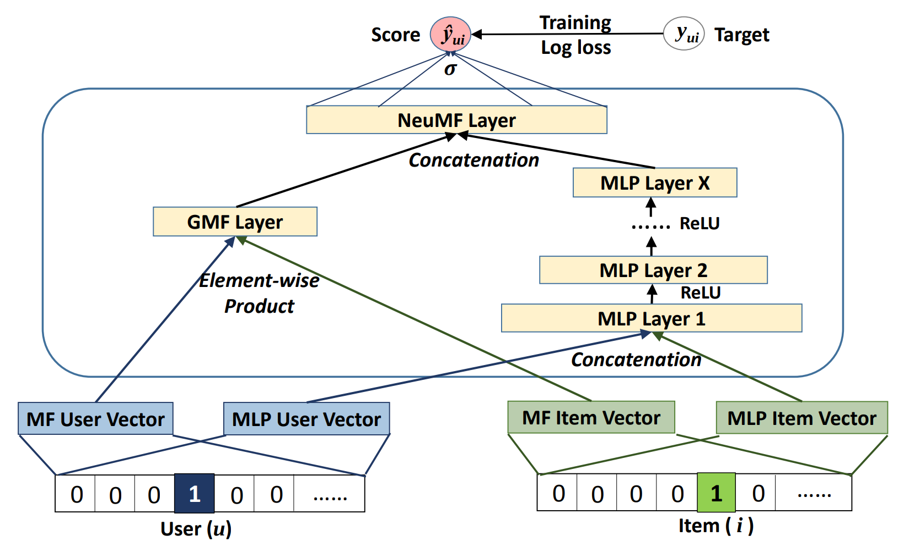
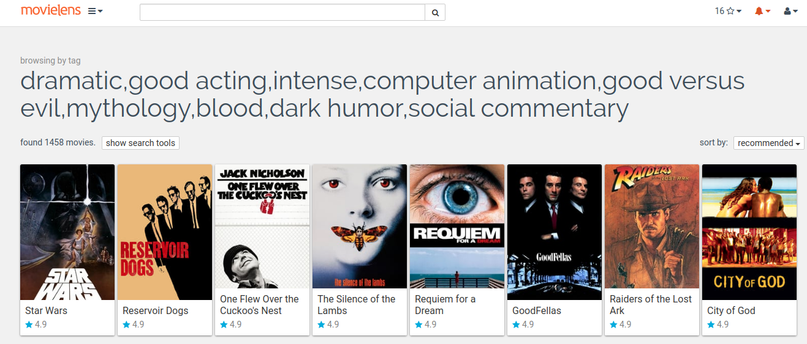

[Recommendation system](https://en.wikipedia.org/wiki/Recommender_system) is a commercial application that predicts the "rating" or "preference" a user would give to an item. One popular design of recommendation systems is collaborative filtering (CF). It is based on the assumption that people who agreed in the past will agree in the future, and that they will like similar kinds of items as they liked in the past. It generates recommendations using only information about rating profiles for different users or items, and does not require an "understanding" of the item itself.

Neural Collaborative Filtering (NCF) is invented to replace the matrix factorization step in CF with a neural architecture that learns an arbitary function from the interaction between user and item features. Experiments on the [MovieLens](https://grouplens.org/datasets/movielens/20m/) dataset shows the model achieves 0.958 for HR@10 (Hit Ratio at 10).

## Architecture

NCF model is based mainly on Embedding and FullyConnected layers. The control flow is divided into two branches. The Multi Layer Perceptron (MLP) branch, transforms the input through FullyConnected layers with ReLU activations and dropout. The Matrix Factorization (MF) branch performs collaborative filtering factorization. Each user and each item has two embedding vectors associated with it -- one for the MLP branch and the other for the MF branch. The outputs from those branches are concatenated and fed to the final FullyConnected layer with sigmoid activation. This can be interpreted as a probability of a user interacting with a given item.

*Archiecture diagram of NCF. Image from [Neural Collaborative Filtering, He et al](https://arxiv.org/abs/1708.05031)*

## Dataset

A standard metric to evaluate recommendation system is `Hit Ratio at N`, or `HR@n`. It calculates the probability for the system to generate a "hit" from an n-sized list of recommanded items. A hit can be defined as something that the user has clicked on, purchased, or saved/favourited. The ground truth for the hit and the input data for producing the recommendation list can be generated from a user's click history using the [leave-one-out](https://en.wikipedia.org/wiki/Cross-validation_(statistics)#Leave-one-out_cross-validation) strategy. 

NCF's performance is evaluated on the [MovieLens 20M](https://grouplens.org/datasets/movielens/20m/) Dataset. The dataset describes 5-star rating and free-text tagging activity from [MovieLens](https://movielens.org/), a movie recommendation service. It contains 20000263 ratings and 465564 tag applications across 27278 movies. These data were created by 138493 users between January 09, 1995 and March 31, 2015. NCF is able to achieve 0.958 for HR@10 (Hit Ratio at 10).

*MovieLens gives personalized movie recommendations to users based on their rating. Image from [MovieLens](https://movielens.org/)*

## GPU Benchmark

import { ModelChart } from './../../../www/src/components/lambda-items.js'

We benchmark the training throughput for GNMT using different GPUs in both FP32 and FP16 precisions. The benchmark is conducted using NVidia docker images. You can use this [repository](https://github.com/lambdal/deeplearning-benchmark) to reproduce the results in the charts below.

<ModelChart selected_model='ncf' selected_gpu='V100' selected_metric="throughput"/>

*Maximum training throughput of NCF (Samples/Second)*

<ModelChart selected_model='ncf' selected_gpu='V100' selected_metric="bs"/>

*Maximum training batch size of NCF (Samples/Batch)*
