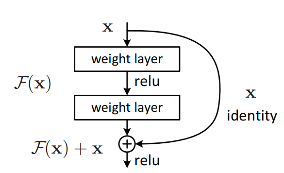
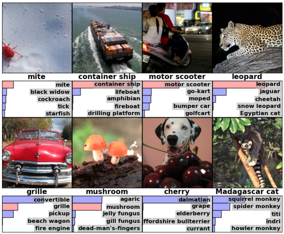

[Paper](https://arxiv.org/abs/1512.03385)   &nbsp; &nbsp; &nbsp; &nbsp; [Code](https://github.com/NVIDIA/DeepLearningExamples/tree/master/PyTorch/Classification/ConvNets/resnet50v1.5)

Deeper neural networks are more difficult to train due to the problem of [vanishing gradient](https://en.wikipedia.org/wiki/Vanishing_gradient_problem). ResNet is a network architecture that eases the vanishing gradient problem with `Residual Blocks`.  ResNet is initially proposed for image classification. An ensemble of 152-layer ResNets won the 1st place on the ILSVRC 2015 classification task with 3.57% Top-5 testing error<sup id="a1">[1](#f1)</sup>. 

Due to its exceptional ability of learning expressive deep features, pre-trained ResNets are widely used as backbones in a variety range of downstream image-based tasks, in particular [instance segmentation](https://arxiv.org/abs/1703.06870). For tasks such as [language modeling](https://arxiv.org/abs/1706.03762) and [reinforcement learning](https://www.nature.com/articles/nature24270%3E) where pre-trained ResNets are not directly applicable, the concept of residual block can still be used to improve the performance of deeper architectures. Some researchers also believe deep residual networks are an implicit [ensemble](https://arxiv.org/abs/1605.06431) of exponentially many shallow networks.

## Architecture

The key contribution of ResNet is the residual block. A residual block sperates an oridinary mapping into an identity part and a residual part. The identity part of the mapping acts as a [highway](https://arxiv.org/pdf/1505.00387.pdf) that allows the gradient to be efficiently back-propogated. A cascade of such identity mappings makes the training of very deep neural networks possible in practice.


*Residual Block. Image from [Deep Residual Learning for Image Recognition, He et al.](https://arxiv.org/abs/1512.03385)*

## Dataset

ResNet's performance is mainly tested by the [ImageNet](http://www.image-net.org/) Large Scale Visual Recognition Challenge. In particular, the image classfication track. The ImageNet dataset is comprised of 1,000 object classes, approximately 1 million images, with 50,000 for a validation and 150,000 for a testing. The classification performance is evaluated as Top-1 and Top-5 error.

*Sample images from ImageNet and the top-5 predicted class labels generated by [AlexNet](https://papers.nips.cc/paper/4824-imagenet-classification-with-deep-convolutional-neural-networks)*

## GPU Benchmark

import { ModelChart } from './../../../www/src/components/lambda-items.js'

We benchmark ResNet50's training performance using different GPUs in both FP32 and FP16 precisions. The benchmark is conducted using NVidia docker images. You can use this [repository](https://github.com/lambdal/deeplearning-benchmark) and the following command to reproduce the results in the charts below.

```
docker run --gpus <devices> \
--rm --shm-size=16g \
-v ~/data:/data \
-v $(pwd)"/scripts":/scripts \
-v $(pwd)"/results":/results nvcr.io/nvidia/pytorch:20.01-py3 \
/bin/bash -c "cp -r /scripts/* /workspace; ./run_benchmark.sh <config_name> resnet"
```
- `devices`: List of GPU devices. For example: "all", "0", "0,1".
- `config_name`: Name of GPU configuration. Select from `["V100", "QuadroRTX8000", "QuadroRTX6000", "QuadroRTX5000", "TitanRTX", "2080Ti", "1080Ti"]`.

<ModelChart selected_model='resnet50' selected_gpu='V100' selected_metric="throughput"/>

*Maximum training throughput of ResNet50 (Images/Second)*


<ModelChart selected_model='resnet50' selected_gpu='V100' selected_metric="bs"/>

*Maximum training batch size of ResNet50 (Images/Batch)*

## Reference

<b id="f1">[1]</b> Kaiming He, Xiangyu Zhang, Shaoqing Ren, Jian Sun. Deep Residual Learning for Image Recognition.