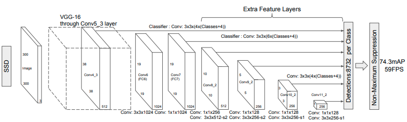
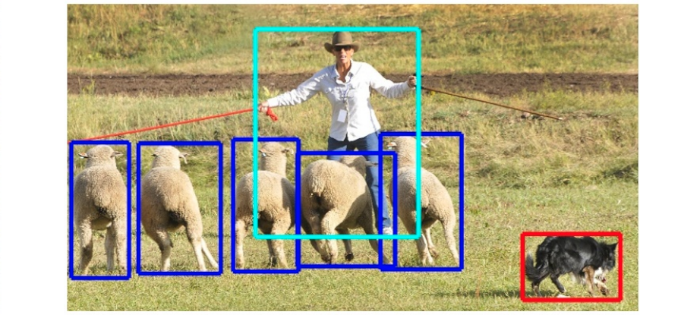

[Paper](https://arxiv.org/abs/1512.02325)   &nbsp; &nbsp; &nbsp; &nbsp; [Code](https://github.com/NVIDIA/DeepLearningExamples/tree/master/PyTorch/Detection/SSD)

Object detection has been a central problem in computer vision and pattern recognition. Its goal is to recognize `what` objects are inside of an image and localize `where` they are. Given an input image, the algorithm outputs a list of objects, each associated with a class label and location (usually in the form of bounding box coordinates).

Since the 2010s, the field of object detection has made significant progress with the help of deep learning. [Single Shot MultiBox Detector (SSD)](https://arxiv.org/abs/1512.02325) is a milestone Neural Netowrks based object detector invented in 2015. SSD300 (with `300 x 300` input) achieved 72.1% mean average precision (mAP) on the [PASCAL Visual Object Classes Challenge](http://host.robots.ox.ac.uk/pascal/VOC/voc2007/) test at 58 FPS on a Nvidia Titan X and SSD512 achieved 75.1% mAP at 22 FPS. On the more challenging [MSCOCO](http://cocodataset.org/) dataset, the mAPs for SSD300 and SSD500 are `23.2` and `26.8` respectively.

SSD shares many similar insights with the concurrent [YOLO](https://pjreddie.com/darknet/yolo/) object detector. Together, they represent a family of methods that run direct pixel to bounding-box regression. These methods (single stage detection) are usually faster but at lower accuracy in comparison to multi-stage approaches, such as [R-CNN](https://arxiv.org/abs/1311.2524) and its descendants.

## Architecture

The key idea of SSD is to leverage deep features to improve both recognition (the `what` task) and localization (the `where` task). As to recognition, deep convolutional neural networks are known to function robustly against appearance variation and spatial transformation, due to the cascade of pooling operations and non-linear activation. As to localization, the inspiration is that neural networks can be trained to directly perform feature to bounding box prediction. 

Importantly, SSD allows feature sharing between the recognition task and the localization task. In fact, only the very last layer is different between these two tasks. Doing so significantly reduced the computation cost and allows the network to learn features that also generalize better. 

The architecture from the [original paper](https://arxiv.org/abs/1512.02325) uses pre-trained `VGG-16` as the backbone for extracting features for the early layers. New layers are added to map the VGG features to class label and bounding box location (the `(classes+4)` part). Detection runs at different scales before non-maximum supression is used to distill the results and returns the most predominant objects. In practice, the `VGG-16` backbone can be replaced by more efficient deep feature extractors such as `ResNet50`.

*SSD architecture. Image from [SSD: Single Shot MultiBox Detector, Liu et al.](https://arxiv.org/abs/1512.02325)*

## Dataset

The performance of object detection is usually evaluated on the Microsoft Common Objects in Context ([MSCOCO](http://cocodataset.org/#home)) dataset. The dataset contains photos of 91 objects types that would be easily recognizable by a 4 year old. It has a total of 2.5 million labeled instances in 328k images. 

The object detection performance is evaluated as mean average precision (mAP). This is a fantasic [article](https://medium.com/@jonathan_hui/map-mean-average-precision-for-object-detection-45c121a31173) that explains what mAP stands for. In gist, it computes the average precision (AP) for each of the 91 COCO object classes and take the meam of them. For each class, the AP measures its detection accuracy by averaging Intersection of Union (IoU) using different thresholds. For example `AP@[.5:.95]` corresponds to the AP using IoU from 0.5 to 0.95 with a step size of 0.05. 

*An example image from MSCOCO dataset where bounding boxes of the target objects are labelled. Image from [Microsoft COCO: Common Objects in Context, Lin et al.](https://arxiv.org/abs/1405.0312)*

## GPU Benchmark

import { ModelChart } from './../../../www/src/components/lambda-items.js'

We benchmark SSD300's training performance using different GPUs in both FP32 and AMP (automatic mixed precision). The benchmark is conducted using NVidia docker images. You can use this [repository](https://github.com/lambdal/deeplearning-benchmark) to reproduce the results in the charts below.

<ModelChart selected_model='ssd' selected_gpu='V100' selected_metric="throughput"/>

*Maximum training throughput of SSD300 (Images/Second)*

<ModelChart selected_model='ssd' selected_gpu='V100' selected_metric="bs"/>

*Maximum training batch size of SSD300 (Images/Batch)*