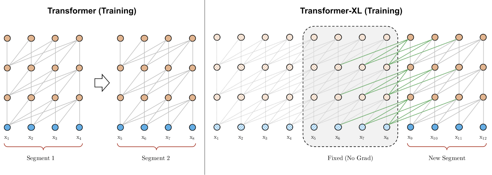

Learning language representation is central to many NLP tasks. It is relatively straightforward to learn representations for [individual words](https://en.wikipedia.org/wiki/Word2vec) or phrases. However, for tasks such as machine translation, it is necessary to take the entire input into consideration and produce a sequence level representation.

Early methods like [seq2seq](https://arxiv.org/abs/1409.3215) compress the input sequence into a "thought vector", and then uncompress the thought vector to the transformed output. A crucial disadvantage of this approach is that all the information needed for producing the output has to be stored in the fixed-dimensional thought vector, which is inefficient when input sequences become longer. Imagining how human translate a long paragraph of text: we rarely memorize the entire paragraph before spelling out its translation. Instead, we progress in a block by block fashion, searching back and forth for the relavent context.

The [attention](https://arxiv.org/abs/1706.03762) model is invented to help process long sequences. Rather than building a fixed thought vector to memorize the input sequence, an attention model updates the thought vector progressively during the transform process. At each step, the thought vector is used as a "pointer" to identify relavent context by comparing itself with every input word. The identified context is then used to generate the output for the current step, and to update the thought vector for the next step.

However, the vanilla attention models need to choose a maximum sentence length so has a fixed and limited attention span. Sequence beyond the maximum length has to be splitted into segements, and be transformed in a segment by segment fashion. A thought vector can only attend to words in the same segments, and no information can flow across separated segments. 

[Transformer-XL](https://arxiv.org/abs/1901.02860) solves the context segmentation problem with two main modifications. It reuses hidden states between segments, and adapts a new positional encoding that is suitable for reused states. As a result, Transformer-XL learns dependency that is 80% longer than RNNs and 450% longer than vanilla Transformers, achieves better performance on both short and long sequences, and is up to 1,800+ times faster than vanilla Transformers during evaluation. Quality-wise, the large version of Transformer-XL achieved 18.3 PPL (perplexity) on WikiText-103. A variation of Transformer-XL with [dynamic evaluation](https://arxiv.org/abs/1904.08378) is able to further reduce PPL to 16.40.


## Architecture

As the architecture diagram shows, the recurrent connections between segments (green connections) is introduced into the model by continuously using the hidden states from the previous segments.

Vanilla Transformer use absolute values to encode positions, hence the previous and current segments will be assigned with the same encoding, which is undesired. In contrast, Transformer-XL encodes the relative position and keeps the positional information flow coherently across segments.


*A comparison between the training phrase of vanilla Transformer & Transformer-XL with a segment length 4. Image from [Transformer-XL: Attentive Language Models Beyond a Fixed-Length Context, Dai et al.](https://arxiv.org/abs/1901.02860)*

## Dataset

Transformer-XL is trained and evaluated on the [WikiText-103](https://www.salesforce.com/products/einstein/ai-research/the-wikitext-dependency-language-modeling-dataset/) dataset. WikiText-103 is a collection of over 100 million tokens extracted from the set of verified Good and Featured articles on Wikipedia. The evaluation metric is [perplexity](https://en.wikipedia.org/wiki/Perplexity) (PPL), which computes the probability of the corpus normalized by the number of words in the corpus. Intuitively, one can think PPL as the [average branching factor](https://brenocon.com/blog/2013/01/perplexity-as-branching-factor-as-shannon-diversity-index/) of a language model -- the lower branching factor, the lower exponentiated cross-entropy between the model and the data, which means a more effective language model.

This is a sample article from the WikiText-103 dataset:

```
= Gold dollar =

 The gold dollar or gold one @-@ dollar piece was a coin struck as a regular issue by the United States Bureau of the Mint from 1849 to 1889 . The coin had three types over its lifetime , all designed by Mint Chief Engraver James B. Longacre . The Type 1 issue had the smallest diameter of any United States coin ever minted .
 A gold dollar had been proposed several times in the 1830s and 1840s , but was not initially adopted . Congress was finally galvanized into action by the increased supply of bullion caused by the California gold rush , and in 1849 authorized a gold dollar . In its early years , silver coins were being hoarded or exported , and the gold dollar found a ready place in commerce . Silver again circulated after Congress in 1853 required that new coins of that metal be made lighter , and the gold dollar became a rarity in commerce even before federal coins vanished from circulation because of the economic disruption caused by the American Civil War .
```

## GPU Benchmark

import { ModelChart } from './../../../www/src/components/lambda-items.js'

We benchmark the training throughput for two different flavors of Transformer-XL (base and large) using different GPUs in both FP32 and FP16 precisions. The benchmark is conducted using NVidia docker images. You can use this [repository](https://github.com/lambdal/deeplearning-benchmark) to reproduce the results in the charts below.


<ModelChart selected_model='transformerxlbase' selected_gpu='V100' selected_metric="throughput"/>

*Maximum training throughput of Transformer-XL Base (Tokens/Second)*


<ModelChart selected_model='transformerxlbase' selected_gpu='V100' selected_metric="bs"/>

*Maximum training batch size of Transformer-XL Base (Tokens/Batch)*


<ModelChart selected_model='transformerxllarge' selected_gpu='V100' selected_metric="throughput"/>

*Maximum training throughput of Transformer-XL Large (Tokens/Second). 2080Ti and 1080Ti has no throughput due to out of memory error.*


<ModelChart selected_model='transformerxllarge' selected_gpu='V100' selected_metric="bs"/>

*Maximum training batch size of Transformer-XL Large (Tokens/Batch)*