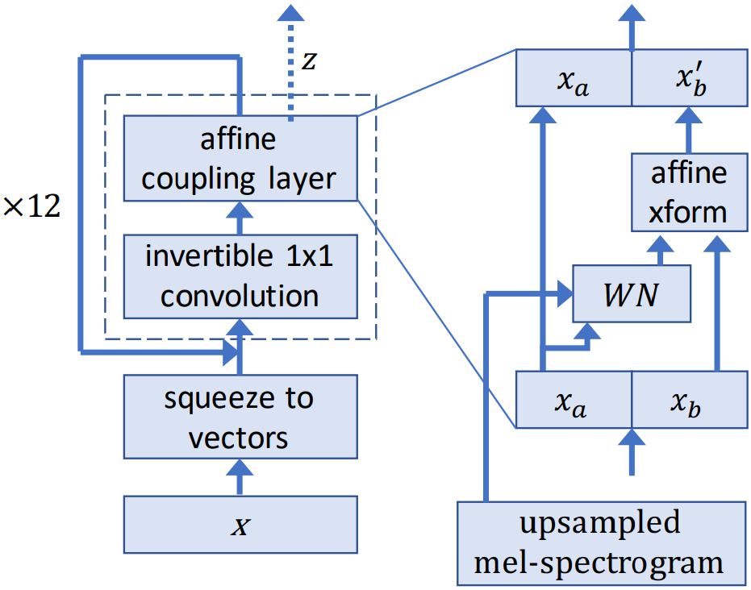

[Text to Speech Synthesis](https://en.wikipedia.org/wiki/Speech_synthesis) generates audios of human speech from text input. Early concatenative synthesis approaches stitch small units of pre-recorded waveforms, hence produce strong boundary artifacts between the units. Statistical parametric approaches can directly generate smoother audio trajectories, but at the cost of producing audio that sounds muffled and unnatural compared to human speech.

[Waveglow](https://arxiv.org/abs/1811.00002) is a flow-based generative model that generates audio samples from Gaussian distribution using mel-spectrogram conditioning. WaveGlow is implemented using only a single network, trained using only a single cost function: maximizing the likelihood of the training data, which makes the training procedure simple and stable. Its PyTorch implementation produces audio samples at a rate of more than 500 kHz on an NVIDIA V100 GPU. Mean Opinion Scores show that it delivers audio quality as good as the best publicly available [WaveNet](https://arxiv.org/abs/1609.03499) implementation. 

## Architecture

Waveglow combines ideas from [Glow](https://arxiv.org/abs/1807.03039) and [WaveNet](https://arxiv.org/abs/1609.03499). During training, Waveglow learns to transform the dataset distribution into spherical Gaussian distribution through a series of flows. One step of a flow consists of an invertible convolution, followed by a modified WaveNet architecture that serves as an affine coupling layer. During inference, the network is inverted and audio samples are generated from the Gaussian distribution. The official implementation uses 512 residual channels in the coupling layer.



*Archiecture diagram of Waveglow. Image from [WaveGlow: A Flow-based Generative Network for Speech Synthesis, Prenger et al](https://arxiv.org/abs/1811.00002)*

## Dataset

Waveglow is trained on the [LJSpeech-1.1](https://keithito.com/LJ-Speech-Dataset/) dataset. It is a public domain speech dataset consisting of 13,100 short audio clips of a single speaker reading passages from 7 non-fiction books. A transcription is provided for each clip. Clips vary in length from 1 to 10 seconds and have a total length of approximately 24 hours. 

The original [Waveglow paper](https://arxiv.org/abs/1811.00002) evaluated the performance of the model with crowd-sourced Mean Opinion Score (MOS) tests on Amazon Mechanical Turk. Waveglow delivers audio quality as good as the best publicly available [WaveNet](https://arxiv.org/abs/1609.03499) implementation.

<!-- Mel stands for Mel Spectrogram, a way of visualizing sound as a Spectrogram in [Mel Scale](https://en.wikipedia.org/wiki/Mel_scale). The Mel Scale converts sound into numbers so that the distance between the numbers matches the distance as it registers to the human ear. It is a “perceptual” scale, where each tone in Hz has a perceptual pitch on the Mel Scale.  -->

<!-- *MovieLens gives personalized movie recommendations to users based on their rating. Image from [MovieLens](https://movielens.org/)* -->


Below is a sample from [LJSpeech-1.1](https://keithito.com/LJ-Speech-Dataset/) dataset:


```
Many animals of even complex structure which live parasitically within others are wholly devoid of an alimentary cavity.
```

<iframe allowtransparency="true" style="background: #FFFFFF;" width="100%" height="155" frameborder="0"
src="https://keithito.com/LJ-Speech-Dataset/LJ025-0076.wav"></iframe>

## GPU Benchmark

import { ModelChart } from './../../../www/src/components/lambda-items.js'

We benchmark the training throughput for Waveglow using different GPUs in both FP32 and FP16 precisions. The benchmark is conducted using NVidia docker images. You can use this [repository](https://github.com/lambdal/deeplearning-benchmark) to reproduce the results in the charts below.


<ModelChart selected_model='waveglow' selected_gpu='V100' selected_metric="throughput"/>

*Maximum training throughput of Tacotron (Mels/Second)*


<ModelChart selected_model='waveglow' selected_gpu='V100' selected_metric="bs"/>

*Maximum training batch size of Tacotron (Mels/Batch)*
